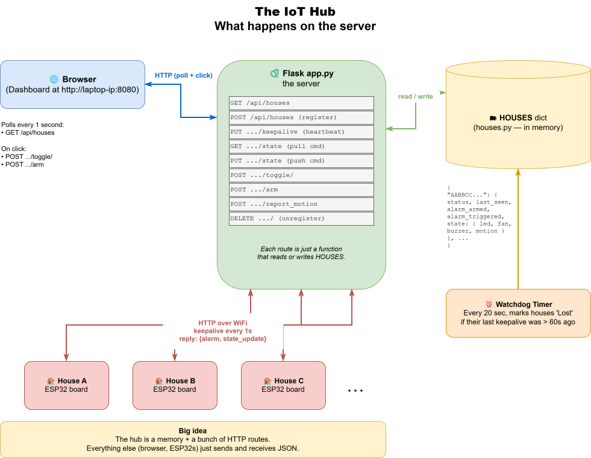

# Day 1 — The Hub

**Goal:** Get the Flask hub running and learn how the dashboard talks to houses over HTTP. By the end you'll register a fake "house" with a single command and watch it appear in your browser.

**Time:** ~2 hours.

## The big picture

Here's the whole system you're building. Today is the green box in the middle — the **hub** — plus the browser dashboard. The ESP32 "houses" join later in the week.

<p align="center">
  
</p>

---

## Part 1 — Setup (15 min)

🛠 **Try this**(diagrams/01_iot_hub.drawio)

1. Open **PyCharm Community**.
2. **File → Open** → navigate to `C:\Projects\sigma\claude\implementation\iot_hub` → Open.
3. PyCharm sees `requirements.txt` and offers to create a venv. Click **Create**.
4. PyCharm tries to install `Flask==3.0.3` from the internet — it'll fail because we're offline. Open the **Terminal** tab at the bottom and run:
   ```bash
   pip install --no-index --find-links wheels -r requirements.txt
   ```
5. Right-click `app.py` in the project tree → **Run 'app'**.
6. Open <http://localhost:8080/> in your browser.

✅ **Milestone 1.1**: You see the dashboard with the message "Waiting for houses to register…".

---

## Part 2 — How HTTP works (20 min)

When the browser asks for a web page, it sends an **HTTP request** like:

```
GET /api/houses HTTP/1.1
Host: localhost:8080
```

The server replies with a **response**:

```
HTTP/1.1 200 OK
Content-Type: application/json

[]
```

The four most common request methods:

| Method | "Verb" meaning | Example |
|---|---|---|
| `GET`    | "give me" | Browser asking for the dashboard |
| `POST`   | "create a new thing" | A house registering |
| `PUT`    | "replace this thing" | A house pushing its current state |
| `DELETE` | "remove this thing" | A house unregistering |

💡 **Why four verbs?** It lets the server know your *intent*. The same URL `/api/houses/AABB` means "look this up" with `GET`, "delete it" with `DELETE`. Same address, different action.

<details>
<summary>🤔 <b>Why is keepalive a PUT but toggle a POST? (idempotency + retries)</b></summary>

You *could* build this whole API with `POST` for everything — it would work. But the verbs carry a promise about **idempotency**: whether doing something once and doing it ten times leave the same result.

- **`PUT`, `GET`, `DELETE` are idempotent.** Repeating them is harmless. `PUT /keepalive` ten times in a row = still just "I'm alive, last_seen = now."
- **`POST` is NOT idempotent.** `POST /toggle/led` twice flips the LED *back* — a different result each time.

**Why this actually matters at camp:** WiFi drops packets. If a request times out, can the board safely re-send it?
- Re-sending a **`PUT` keepalive** → totally safe (same result).
- Re-sending a **`POST` toggle** → dangerous (might flip the LED back).

So the verb is a *warning label*: `PUT`/`GET`/`DELETE` mean "safe to retry"; `POST` means "think before you retry." That's why keepalive (safe to repeat) is `PUT`, and toggle/register/report_motion (actions with side-effects) are `POST`.
</details>

<details>
<summary>🤔 <b>Why can't I just register a house with GET (by typing a URL)?</b></summary>

It would be convenient — a browser address bar can only do `GET`, so "register by visiting a link" sounds handy. But there's an iron rule: **`GET` must be *safe* — it reads, it never changes anything.** Registering *creates* a house (a side-effect), so it must be a `POST`.

This isn't pedantry. Lots of things follow `GET` links **automatically**, without a human clicking: browser prefetchers, link-preview bots (Slack/Discord unfurling a pasted URL), search-engine crawlers, antivirus URL scanners. If `GET` registered a house, any of them could spawn phantom houses just by *looking* at a link.

> 💥 **True story (2005):** Google's "Web Accelerator" pre-fetched every link on a page to feel faster. Many web apps used `GET` links like `/delete?id=5` for their buttons. The accelerator dutifully pre-fetched them all — and **silently deleted users' data across the internet.** The lesson the whole industry learned: *never put an action behind a `GET`.*

So to register, you `POST` — with `curl`, the DevTools console, or the ESP32's code. Not by typing a URL.
</details>

### What is `curl`?

`curl` is a tiny command-line tool that sends an HTTP request and prints the response — **a browser with no window.** Your browser also sends HTTP requests, but it wraps them in a pretty page. `curl` shows you the raw conversation, which is perfect for learning and testing. The name means "see URL" (cURL).

Anatomy of a `curl` command you'll use a lot:

```bash
curl -X POST http://localhost:8080/api/houses -H "Content-Type: application/json" -d '{"unique_id":"FAKE001"}'
#    └──┬──┘ └──────────────┬──────────────┘ └──────────────┬──────────────┘ └──────────────┬──────────────┘
#     verb         the URL (where)              a header (extra info)            the body (the data you send)
```

- No `-X` given → `curl` defaults to **GET**.
- `-X POST` / `-X PUT` / `-X DELETE` → pick the verb.
- `-H` → add a header (we use it to say "my body is JSON").
- `-d` → the data/body to send.

🛠 **Try this** in PyCharm's terminal (a plain GET — no flags needed):

```bash
curl http://localhost:8080/api/houses
```

You should see `[]` — an empty list.

---

## Part 2b — What the server says back (status codes) (5 min)

Every response starts with a **status code** — a 3-digit number that says how it went, *before* you even read the body. You'll see these pop out of `curl` in the next parts, so know them:

| Code | Nickname | Means | When you'll see it |
|---|---|---|---|
| **200** | OK | It worked. | Most successful requests (keepalive, toggle, state). |
| **201** | Created | Made a new thing. | When you register a house (`POST /api/houses`). |
| **400** | Bad Request | *You* sent something wrong. | Missing/!malformed JSON — e.g. you forgot the `Content-Type` header. |
| **404** | Not Found | That thing doesn't exist. | Asking about a house ID the hub never heard of. |

💡 **The first digit is the mood:**
- **2xx** = success 🟢
- **4xx** = *you* messed up (your request) 🟡
- **5xx** = *the server* messed up (a bug in the hub) 🔴

So `404` is never the hub's fault — it's saying "I looked, that house isn't here." A `500` *would* be the hub's fault. (There's also `1xx` and `3xx`, but you won't meet them in this project.)

🛠 **See a code yourself:** add `-i` to any `curl` to print the status line at the top:

```bash
curl -i http://localhost:8080/api/houses
```

The first line will read `HTTP/1.1 200 OK`.

---

## Part 3 — Register a fake house (20 min)

The dashboard is empty because no boards have registered yet. Let's pretend to be a board using `curl`.

🛠 **Try this**:

```bash
curl -X POST http://localhost:8080/api/houses \
  -H "Content-Type: application/json" \
  -d '{"unique_id":"FAKE001","ip_address":"127.0.0.1"}'
```

Response: `{"ok": true, "unique_id": "FAKE001"}`.

Now refresh the browser. **A row appears!** Status: `Active`.

> 🧪 **No terminal? Use the browser console instead.** Open the dashboard (`http://localhost:8080/`), press **F12** → **Console** tab, and paste:
> ```javascript
> await fetch("/api/houses", {
>   method: "POST",
>   headers: { "Content-Type": "application/json" },
>   body: JSON.stringify({ unique_id: "FAKE001", ip_address: "127.0.0.1" })
> }).then(r => r.json())
> ```
> Same result — `{ok: true, unique_id: "FAKE001"}` — no `curl`, no quoting headaches. This works because the page came from the hub, so the relative path `/api/houses` points straight at it. It's also *exactly* what `dashboard.js` does when a button is clicked.

🛠 **Try this**: send a "keepalive" — this is what real boards do every second to prove they're alive:

```bash
curl -X PUT http://localhost:8080/api/houses/FAKE001/keepalive \
  -H "Content-Type: application/json" -d '{"ip_address":"127.0.0.1"}'
```

Response: `{"alarm": false, "state_update": false}`.

### How keepalive really works (and why it exists)

This is the heartbeat of the whole system, so it's worth understanding properly.

**The problem it solves:** the hub has *no way to know* if a board is still alive. A board could be unplugged, crashed, or out of WiFi range — and the hub would never be told. There's no "the board died" message, because a dead board can't send one. So instead, every board promises: *"I'll wave at you every second. If I stop waving, assume I'm gone."* That wave is the keepalive.

**Each keepalive does two jobs at once:**

1. **"I'm still here."** The hub writes down the current time as that house's `last_seen`. A separate **watchdog** wakes up every 20 seconds and checks: *has any house gone quiet for more than 60 seconds?* If so → mark it **`Lost`** (the row turns red) and switch off its alarm.

2. **The hub's only chance to talk back.** Here's the subtle part: **the hub can never phone the board first.** The board is behind the WiFi router; the hub can't reach in and start a conversation. The board always speaks first, and the hub can only *answer*. So the hub piggybacks any instructions onto the keepalive **reply**:

   - `alarm`: "fire your buzzer right now"
   - `state_update`: "the dashboard changed your settings — call `GET /state` to pull them"

   Both `false` means "nothing for you, carry on."

💡 **This pattern is called *polling*:** the board keeps asking "anything for me? anything for me?" once a second, and the hub answers. It's not the fanciest design (a real-time system might use WebSockets so the hub can push instantly), but it's dead simple to understand and debug — and one second of delay is invisible to a human flipping a light switch.

⚡ **Stretch — watch the watchdog work:** stop sending keepalives for this house. Refresh the dashboard every few seconds. After ~60 seconds the row flips to **`Lost`** and turns red. Start sending keepalives again → it goes back to **`Active`**. You just watched the heartbeat die and revive.

---

## Part 4 — Read the routes (20 min)

Open `implementation/iot_hub/app.py`. Find the `# ---------- per-house ----------` comment.

🛠 **Try this**: trace what happens when the browser clicks the LED toggle button.

<details>
<summary>▶ Solution</summary>

1. Browser sends `POST /api/houses/FAKE001/toggle/led` (look at `dashboard.js` line ~94).
2. Flask matches the route `@app.route("/api/houses/<uid>/toggle/<device>", methods=["POST"])` and calls `toggle()`.
3. `toggle()` validates the device name, then calls `houses.toggle_device(uid, device)`.
4. `houses.toggle_device` flips `state["led"]["active"]` and sets `pending_state_update = True`.
5. Returns `{"ok": True}`.

Next time the (imaginary) board sends a keepalive, it gets `state_update: true` and pulls the new state.
</details>

---

## Part 5 — Add your own endpoint (40 min)

The hub has no "panic button" — a single endpoint that disarms ALL alarms at once. Let's add one.

### Spec

- Method: `POST`
- URL: `/api/disarm_all`
- Body: none
- Response: `{"ok": true, "count": <how many were disarmed>}`
- Behavior: walks every house and sets `alarm_armed = False`, `alarm_triggered = False`, and turns off the buzzer state.

### Step 1 — add the data-layer function

Open `houses.py`. Add this function (you fill in the TODO):

```python
def disarm_all() -> int:
    """Disarm every house. Returns how many were armed before."""
    count = 0
    with _LOCK:
        for house in HOUSES.values():
            if house["alarm_armed"]:
                count += 1
            # TODO: clear alarm_armed, alarm_triggered, and the buzzer
            #       (look at how arm_alarm() does it)
    return count
```

<details>
<summary>▶ Solution</summary>

```python
def disarm_all() -> int:
    """Disarm every house. Returns how many were armed before."""
    count = 0
    with _LOCK:
        for house in HOUSES.values():
            if house["alarm_armed"]:
                count += 1
            house["alarm_armed"] = False
            house["alarm_triggered"] = False
            house["state"]["buzzer"]["active"] = False
            house["pending_state_update"] = True
    return count
```
</details>

### Step 2 — add the route

Open `app.py`. Add this near the other `arm` route:

```python
@app.route("/api/disarm_all", methods=["POST"])
def disarm_all():
    # TODO: call houses.disarm_all() and return the right JSON
    pass
```

<details>
<summary>▶ Solution</summary>

```python
@app.route("/api/disarm_all", methods=["POST"])
def disarm_all():
    n = houses.disarm_all()
    return jsonify({"ok": True, "count": n})
```
</details>

### Step 3 — test it

Restart the hub (PyCharm's red square then green play, or `Ctrl-C` and re-run).

```bash
# Register a couple of fake houses, arm them
curl -X POST http://localhost:8080/api/houses -H "Content-Type: application/json" \
  -d '{"unique_id":"FAKE001","ip_address":"127.0.0.1"}'
curl -X POST http://localhost:8080/api/houses -H "Content-Type: application/json" \
  -d '{"unique_id":"FAKE002","ip_address":"127.0.0.1"}'
curl -X POST http://localhost:8080/api/houses/FAKE001/arm \
  -H "Content-Type: application/json" -d '{"armed":true}'
curl -X POST http://localhost:8080/api/houses/FAKE002/arm \
  -H "Content-Type: application/json" -d '{"armed":true}'

# Hit the panic button
curl -X POST http://localhost:8080/api/disarm_all
# expect: {"ok": true, "count": 2}
```

Refresh the dashboard — both houses should now show "Disarmed".

✅ **Milestone 1.2**: Your panic button works. Show a counsellor.

---

## Part 6 — Stretch challenges (10 min)

⚡ **Easy**: Add a `GET /api/stats` endpoint that returns `{"total": N, "active": A, "lost": L, "armed": M}`.

⚡ **Medium**: Add a button to the dashboard that calls your `/api/disarm_all`. (Edit `dashboard.js`.)

⚡ **Hard**: The current keepalive returns `{alarm, state_update}`. Add a third flag, `restart_requested`, that students can set via a new `POST /api/houses/<uid>/request_restart` endpoint — useful for forcing a board to reload.

---

## What you learned today

- **HTTP verbs:** GET, POST, PUT, DELETE — same address, different intent.
- **Status codes:** 200 OK, 201 Created, 400 (you messed up), 404 (not found), and the "first digit is the mood" rule.
- **`curl`** — a browser with no window; `-X` verb, `-H` header, `-d` body, `-i` to see the status line.
- **Flask routes:** `@app.route("/path", methods=["..."])`.
- The hub stores everything in a Python dict (`HOUSES`).
- **Keepalive = the heartbeat:** the board waves every second so the watchdog knows it's alive, and it's the hub's *only* chance to send instructions back (polling).

**Tomorrow:** we leave the hub running and start coding on the actual ESP32. → [day2.md](day2.md)
