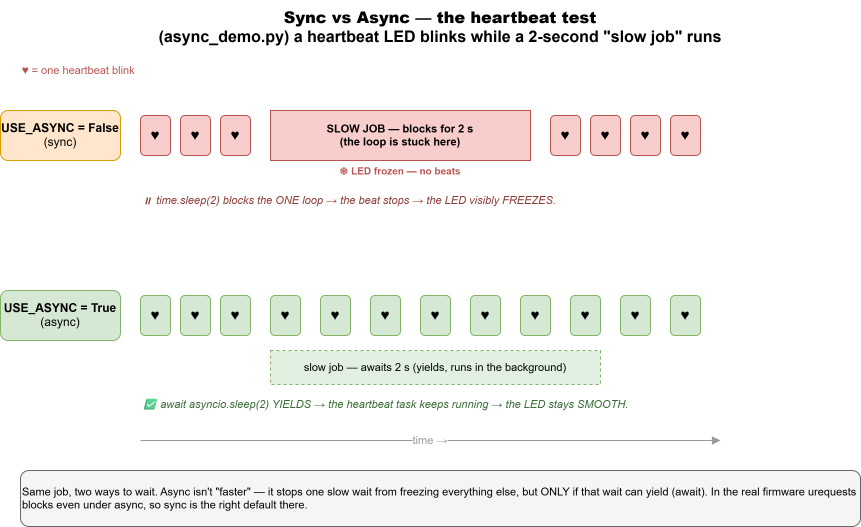

# Day 5 — Async + Final Project

**Goal:** Compare the synchronous and async versions of the firmware to see what `async/await` actually changes, then build a feature of your choice.

**Time:** ~2 hours.

**Prereqs:** Day 4 — global alarm working, you can add data-layer functions and routes.

> 🔬 **See async for real:** [examples/day5_async/async_demo.py](examples/day5_async/async_demo.py) blinks a heartbeat LED while a fake "slow job" runs. Flip `USE_ASYNC` and watch the LED **freeze** (sync) vs **stay smooth** (async) — the difference the real firmware can't show you.

<p align="center">
  
</p>

---

## Part 1 — Same behavior, two shapes (20 min)

You already know `app_sync.py`. Today's surprise: `app_async.py` does the **exact same thing** with the **same hardware drivers** and the **same `hub_client.py`**. Only the loop structure is different.

🛠 **Try this**: switch your board to async.

1. Open `config.py` on the board (Thonny → board pane → double-click).
2. Change `USE_ASYNC = False` to `USE_ASYNC = True`.
3. Save and press the ESP32's RESET button.
4. Watch the LCD: same "Connecting…" → "Ready". Test that the dashboard toggle still moves the LED. **Identical user-facing behavior.**

✅ **Milestone 5.1**: The board behaves identically with `USE_ASYNC=True`.

---

## Part 2 — Diff the two files (25 min)

🛠 **Try this**: in PyCharm, select both `app_sync.py` and `app_async.py` in the project tree, right-click → **Compare Files**. PyCharm shows them side by side with differences highlighted.

Notice:
- The **helpers** (`_connect_wifi`, `_build_state`, `_apply_state`, `_toggle`) are identical.
- `app_sync.py` has ONE `while True` loop checking everything sequentially, with `time.sleep_ms(50)`.
- `app_async.py` has **three concurrent tasks** (`task_buttons`, `task_motion`, `task_keepalive`), each with its own `while True` and its own `await asyncio.sleep_ms(...)`.

### What `await` actually does

In sync code:
```python
time.sleep_ms(50)   # CPU does NOTHING for 50 ms.
```

In async code:
```python
await asyncio.sleep_ms(50)   # "I'll be busy in 50 ms — go run other tasks meanwhile."
```

So while `task_keepalive` is sleeping for 1 second between heartbeats, `task_buttons` and `task_motion` keep running. In the sync version, the single loop has to round-robin everything, so it CAN'T sleep for a full second — that's why we used `time.sleep_ms(50)` (loop runs 20×/sec).

💡 **Subtle point**: `await` only switches tasks at `await` points. If a task does `time.sleep(5)` (the synchronous version!) inside an async function, **everything stops for 5 seconds**. This is why our async version explicitly notes that `urequests` is blocking — for 100-200 ms during an HTTP call, the other tasks pause.

🛠 **Try this — observe it**: add a print to `task_buttons` that fires on every loop iteration. Watch the Thonny shell during a slow operation:

```python
async def task_buttons(button_a, button_b, led, fan, buzzer, motion, hub, lcd, ctx):
    while True:
        if button_a.was_pressed():
            ...
        if button_b.was_pressed():
            ...
        print(".", end="")     # <-- add this
        await asyncio.sleep_ms(30)
```

Press button B (which triggers an HTTP push). Watch the dots: you'll see them stream, pause briefly during the HTTP call, then resume. In the sync version, dots would only print every 50 ms regardless.

---

## Part 3 — When to choose which (15 min)

| Scenario | Sync | Async |
|---|:---:|:---:|
| Reading a temperature once | ✅ simpler | overkill |
| Three things on three different schedules | round-robin works but complex | ✅ natural |
| One slow blocking call (HTTP, file write) | blocks everything | also blocks (without `aiohttp` etc.) |
| Beginner reading the code | ✅ top-to-bottom | needs `await` knowledge |
| You'll later add 5 more concurrent activities | gets messy | ✅ scales |

**Take-away:** for most embedded code, **sync is fine and clearer**. Async pays off when you have several independent activities with different timing.

For our project, sync is the default, async exists because it's a great teaching example of a real refactor.

---

## Bonus — Reading a real RFID card (20 min)

There are three RFID files in `examples/day5_async/`, and only ONE of them touches hardware. This trips everyone up, so read the table first:

| File | Reads a real card? | What it's for |
|---|:---:|---|
| `rfid_hello.py` | **yes** | The only file that talks to the MFRC522 reader. Prints the UID of whatever you tap. |
| `1_rfid_lock_simple.py` | no | The **lock logic** — "is this card allowed?" — with pretend taps. Runs on your laptop. |
| `2_rfid_lock_async.py` | no | The same logic done async, with a heartbeat LED and a simulated reader. |

> ⚠️ **`1_rfid_lock_simple.py` will never read your card.** There is no reader code in it at all — its "taps" are a hardcoded list of UIDs at the top of `main()`. That's on purpose: deciding *whether a card may open the door* is worth learning on its own, and it runs anywhere with no wiring. **`rfid_hello.py` is the file that reads cards.** The two halves meet in the YOUR TURN section of `2_rfid_lock_async.py`.

### First, two names: PCD and PICC

The library uses the official ISO 14443 names, which look like alphabet soup until someone tells you:

- **PCD** = *Proximity Coupling Device* = **the reader** (the MFRC522 board).
- **PICC** = *Proximity Integrated Circuit Card* = **the card** you tap.

So `PCD_Init()` means "set up the reader" and `PICC_IsNewCardPresent()` means "is a card sitting there?".

### How `rfid_hello.py` works

**1. Wire up the reader.**

```python
addr = 0x28
scl  = 22
sda  = 21
rc522 = mfrc522(scl, sda, addr)
```

This is I2C: two wires, `scl` (clock) and `sda` (data), plus an address so the board knows which chip it's talking to. `0x28` is the MFRC522's address on our kit — if that doesn't match the module, nothing works and every read comes back as garbage.

Look inside `soft_iic.py` if you're curious: it doesn't use MicroPython's built-in `machine.I2C` at all. It implements I2C **by hand**, toggling the two pins high and low with `time.sleep_us(5)` between edges. That's called *bit-banging*, and it's why any two GPIO pins work.

**2. Wake the chip up.**

```python
rc522.PCD_Init()
```

Three things happen in here (see `mfrc522_i2c.py:103`): a soft reset, a timeout timer so a half-finished card conversation can't hang forever, and — the important one — `PCD_AntennaOn()`. **After a reset the antenna is OFF.** No antenna means no radio field, means no card is ever detected. This one line is the difference between a working reader and a silent one.

**3. Sanity-check the wiring.**

```python
rc522.ShowReaderDetails()
```

This reads one register (`VersionReg`) and prints it. It's the cheapest possible "are you there?" test:

- `145 = v1.0` or `146 = v2.0` → the reader is wired correctly and answering.
- `0`, `255`, or `unknown` → the reader is **not** talking. Check the wires and the address before debugging anything else.

**4. Poll for a card.**

```python
while True:
    if rc522.PICC_IsNewCardPresent():
        if rc522.PICC_ReadCardSerial() == True:
```

Two steps, because they're two different radio conversations:

- `PICC_IsNewCardPresent()` shouts "anyone out there?" (a REQA command) and returns True if *something* answered. It doesn't know who.
- `PICC_ReadCardSerial()` then does the real work: it runs *anti-collision* (sorting out which card to talk to, in case two are on the reader) and asks the winner for its UID.

**5. Read the UID.**

```python
uid_bytes = rc522.uid.uidByte[0: rc522.uid.size]
uid_hex = ' '.join(f'{b:02X}' for b in uid_bytes)
print("UID (Hex):", uid_hex)
```

The UID lands in `rc522.uid` as a side effect of step 4 — the function returns `True`/`False`, not the card. UIDs are 4, 7 or 10 bytes long (that's what `uid.size` tells you), so you slice off just the real bytes and format them as hex: `DE AD BE EF`.

**That string is the whole point of an RFID reader.** Everything after this is just a decision about a string — which is exactly what `1_rfid_lock_simple.py` teaches.

**6. Decide.**

```python
for i in rc522.uid.uidByte[0: rc522.uid.size]:
    data = data + i
if (data == 645):
    print("open")
```

It adds up the UID's bytes and opens if the total is 645. It works, but think about it for a second: **any** card whose bytes happen to sum to 645 opens the door, and to enroll a friend's card you'd have to do arithmetic. That's why `1_rfid_lock_simple.py` replaces this with an allow-list — `if uid in self.allowed` — which is both safer and easier to read.

### Gotchas you'll hit

- **Lift the card between taps.** `PICC_IsNewCardPresent()` only invites cards in the IDLE state. A card left sitting on the reader has already been selected, so it goes quiet. Lift it off and tap again.
- **`time.sleep(1)` at the bottom of the loop.** The reader is checked once per second, so a quick tap can be missed entirely — hold the card there. And during that second the board can do *nothing else*: no LED, no buttons, no hub. That's the exact problem Part 2 was about, and it's why `2_rfid_lock_async.py` polls with `await sleep_ms(150)` instead — same reader, but the heartbeat keeps beating between checks.
- **`error: 0`** means a card answered step 4 but its UID couldn't be read (moved too fast, or two cards at once). It's a near-miss, not a broken reader.

🛠 **Try this**: run `rfid_hello.py` on a board with a reader attached, tap a card, and copy the hex UID it prints. Paste it into the `allowed=[...]` list in `1_rfid_lock_simple.py` (and into `taps`) — now the lock logic knows *your* card. Wiring the two together for real is exactly what YOUR TURN #1 in `2_rfid_lock_async.py` walks you through.

---

## Part 4 — Final project (60 min)

Pick ONE of these and build it end-to-end. You have ~1 hour. A counsellor is around if you're stuck. Show the result before you leave.

### Option A — "Doorbell" (medium)

Add a third button option: pressing button B when the LCD shows **DOORBELL** flashes the LED on **all** houses for 2 seconds.

Hints:
- Add `"doorbell"` to the `MENU` tuple in `app_sync.py`.
- New endpoint `POST /api/ring_doorbell` that walks every house and sets `state.led.active = True` and `pending_state_update = True`.
- A way to turn LEDs back off after 2 sec — easiest is a `threading.Timer` in `app.py`.
- Press button B with menu on `doorbell` → `hub_client` POST to your new endpoint.

### Option B — "Fan party" (easy)

Make the fan spin in the OPPOSITE direction every other time button B presses it. (The fan supports clockwise + counter-clockwise — see `devices/fan.py`.)

Hints:
- Track a `clockwise = True` variable in `app_sync.py`.
- When toggling the fan ON, alternate the direction.
- Optionally: add a dashboard column "spin direction" so you can see it remotely.

### Option C — "Statistics page" (medium)

Add a new web page at `/stats` that shows:
- Total houses
- How many active vs. lost
- How many armed
- Last alarm fired (timestamp)

Hints:
- New route in `app.py` returning `render_template("stats.html")`.
- New template under `templates/`.
- Track "last alarm" by adding a module-level variable in `houses.py` set inside `report_motion`.

### Option D — "Soft alarm escalation" (hard)

Currently the buzzer either fires (alarm true) or doesn't. Make it escalate: first 5 seconds beep softly (lower duty cycle), next 5 seconds beep medium, after 10 seconds full blast.

Hints:
- `Buzzer` needs a `set_level(0..1023)` method.
- Track when the alarm was triggered (timestamp) — easiest in `app_sync.py`.
- Reset the level when alarm is cleared.

### Option E — "Two-house Morse chat" (hard, two teams)

Pair with another team. Pressing your button A sends a "dot" (LED flash on partner's house, 100 ms). Holding it sends a "dash" (300 ms). Try sending HI (•••• ••).

Hints:
- New endpoint `POST /api/houses/<uid>/flash` with body `{"ms": 100}`.
- Tell button A which target uid (hardcode in `secrets.py`).
- Long-press detection: store the press start time, look at duration on release.

### Or invent your own

Run the idea past a counsellor first to make sure it fits the time.

✅ **Milestone 5.2**: Your final project works end-to-end. Demo it.

---

## Part 5 — Wrap-up (10 min)

### What this whole project taught you

You built and understood:

- **Server-side Python**: HTTP, Flask, route handlers, JSON, threading + locks.
- **Browser-side JS**: `fetch`, JSON, polling, dynamic table rendering.
- **Embedded Python**: GPIO, PWM, I2C, interrupts, async/await.
- **Networking**: WiFi setup, HTTP client, request/response cycles.
- **Architecture**: separating data from routes, separating drivers from app logic, two implementations sharing one HTTP client.

That's a real distributed system. Smaller than what you'd build at a job, but the same shape.

### Where to go next

- **Front-end** — try rebuilding the dashboard with React or HTMX for fun.
- **Real protocol** — replace polling with WebSockets or MQTT for instant push (no 1-second delay).
- **Persistence** — add a SQLite database so houses don't disappear on hub restart.
- **Security** — add API tokens (right now anyone on the WiFi can toggle anyone's LED).
- **Other boards** — Raspberry Pi Pico W runs MicroPython too, with different sensors.
- **Other languages** — try writing the firmware in Arduino C++ to feel the difference.

### Good books and resources (offline-friendly)

- The [MicroPython docs](https://docs.micropython.org/) — bundled in `claude/docs/` if your camp pre-downloaded them.
- The [Flask docs](https://flask.palletsprojects.com/) — same.
- The original `SigmaHouse-master/` repo for ideas (RFID, OLED, more sensors).

---

## Final milestone

✅ **Milestone 5.3**: Demo your project to the group. Explain in 2 minutes:
- What you built.
- One thing that surprised you.
- One thing you'd do differently.

That's the end. Good work — you wrote real code that runs on real hardware that talks to a real server. The next thing you build will be easier.

← back to [INDEX.md](INDEX.md)
